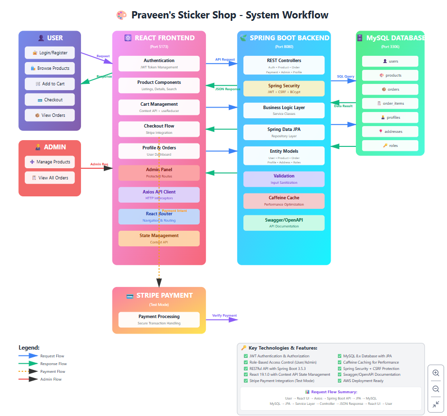

# 🎨 Praveen's Sticker Shop

[](https://www.oracle.com/java/)
[](https://spring.io/projects/spring-boot)
[](https://reactjs.org/)
[](https://www.mysql.com/)
[](https://stripe.com/)
[](https://aws.amazon.com/)

> **Note:** This application is currently deployed on AWS using free tier credits. The live deployment may be unavailable if free credits are exhausted.

## 📋 Project Overview

A full-featured e-commerce web application for selling creative stickers, developed alongside XYZ Company training on Java Full Stack Development with DevOps and Cloud. This project demonstrates modern web development practices, secure authentication, payment integration, and cloud deployment capabilities on AWS.

### 🌟 Key Features

- **User Authentication & Authorization**
  - JWT-based secure authentication
  - Role-based access control (User/Admin)
  - Password encryption using BCrypt
  - Protected routes and endpoints

- **Product Management**
  - Browse sticker collections
  - Search and filter functionality
  - Sort by popularity, price, or category
  - Detailed product views

- **Shopping Experience**
  - Add to cart functionality
  - Real-time cart updates
  - Responsive checkout process

- **Payment Integration**
  - Stripe payment gateway (Test mode)
  - Secure payment processing
  - Order confirmation and tracking

- **Admin Panel**
  - Manage products (CRUD operations)
  - View and manage orders
  - Customer message management
  - Protected admin routes

- **Security Features**
  - CSRF protection
  - Spring Security implementation
  - Secured REST API endpoints
  - Token expiration handling

## 🛠️ Technology Stack

### Frontend
- **React 19.1.0** - UI library
- **React Router v7.7.1** - Navigation and routing
- **Axios 1.11.0** - HTTP client
- **Tailwind CSS 4.1.11** - Styling framework
- **Vite 7.0.4** - Build tool and dev server
- **FontAwesome 6.7.2** - Icon library
- **React Toastify 11.0.5** - Toast notifications
- **Stripe React** - Payment UI components

### Backend
- **Java 17** - Programming language
- **Spring Boot 3.5.3** - Application framework
- **Spring Security** - Authentication & authorization
- **Spring Data JPA** - Data persistence
- **Spring Validation 3.0.2** - Input validation
- **MySQL 8.x** - Relational database
- **JWT (JJWT 0.12.6)** - Token-based authentication
- **Stripe Java 29.4.0** - Payment processing
- **Springdoc OpenAPI 2.8.9** - API documentation (Swagger UI)
- **Lombok** - Code generation and boilerplate reduction
- **Spring Boot DevTools** - Hot reload for development
- **Spring Boot Actuator** - Application monitoring and health checks
- **Logback** - Advanced logging with profile-based configuration

### Tools & DevOps
- **IntelliJ IDEA** - Backend development IDE
- **VS Code** - Frontend development IDE
- **Maven 3.6+** - Dependency management & build tool
- **Postman** - API testing
- **MySQL Workbench** - Database management
- **AWS EC2** - Cloud hosting
- **Git** - Version control

## 📐 Architecture



## 🗄️ Database Schema

### Key Entities & Relationships
- **User** ↔ **Profile** (OneToOne)
- **User** ↔ **Address** (OneToOne)
- **User** ↔ **Roles** (ManyToMany)
- **User** ↔ **Orders** (OneToMany)
- **Order** ↔ **OrderItems** (OneToMany)
- **Product** ↔ **OrderItems** (OneToMany)

## 🚀 Getting Started

### Prerequisites
- Java 17 or higher
- Node.js 16+ and npm
- MySQL 8.x
- Maven 3.6+
- Postman (for API testing)

### Backend Setup

1. **Clone the repository**
```bash
git clone https://github.com/yourusername/praveen-sticker-shop.git
cd praveen-sticker-shop/ecommerce-backend
```

2. **Configure database**
```properties
# application.properties
spring.datasource.url=jdbc:mysql://localhost:3306/sticker_shop
spring.datasource.username=your_username
spring.datasource.password=your_password
spring.jpa.hibernate.ddl-auto=update
```

3. **Configure application profiles**
The application supports multiple profiles (dev, prod) with different logging configurations:
```properties
# Set active profile
spring.profiles.active=dev
```

4. **Configure Stripe**
```properties
stripe.api.key=your_stripe_secret_key
stripe.api.public.key=your_stripe_public_key
```

5. **Configure JWT**
```properties
jwt.secret=your_jwt_secret_key
jwt.expiration=86400000
```

6. **Run the application**
```bash
mvn clean install
mvn spring-boot:run
```

The backend will start on `http://localhost:8080`

**API Documentation:** Access Swagger UI at `http://localhost:8080/swagger-ui/index.html`

### Frontend Setup

1. **Navigate to frontend directory**
```bash
cd ../ecommerce-ui
```

2. **Install dependencies**
```bash
npm install
```

3. **Configure environment variables**
Create a `.env.dev` file:
```env
VITE_API_BASE_URL=http://localhost:8080/api/v1
VITE_STRIPE_PUBLIC_KEY=your_stripe_public_key
```

4. **Start development server**
```bash
npm run dev
```

The frontend will start on `http://localhost:5173`

5. **Build for production**
```bash
# For development environment
npm run build:dev

# For localhost testing
npm run build:localhost
```

## 📚 API Documentation

Once the backend is running, access the interactive API documentation at:
- **Swagger UI:** `http://localhost:8080/swagger-ui/index.html`
- **OpenAPI Spec:** `http://localhost:8080/v3/api-docs`

### API Controllers Overview

The application exposes the following REST API controllers:

1. **profile-controller** - User profile management
2. **payment-controller** - Stripe payment integration
3. **order-controller** - Order management
4. **contact-controller** - Contact form submissions
5. **auth-controller** - Authentication and registration
6. **admin-controller** - Admin operations (orders, messages)
7. **product-controller** - Product CRUD operations
8. **csrf-controller** - CSRF token generation

### Key Endpoints

#### Authentication (`/api/v1/auth`)
- `POST /api/v1/auth/register` - User registration
- `POST /api/v1/auth/login` - User login and JWT token generation

#### Products (`/api/v1/products`)
- `GET /api/v1/products` - Get all products with pagination and sorting
- `GET /api/v1/products/{id}` - Get product details by ID
- `POST /api/v1/products` - Create new product (Admin only)
- `PUT /api/v1/products/{id}` - Update product (Admin only)
- `DELETE /api/v1/products/{id}` - Delete product (Admin only)

#### Profile Management (`/api/v1/profile`)
- `GET /api/v1/profile` - Get user profile
- `PUT /api/v1/profile` - Update user profile

#### Orders (`/api/v1/orders`)
- `GET /api/v1/orders` - Get user's orders
- `POST /api/v1/orders` - Create new order
- `GET /api/v1/admin/orders` - Get all orders (Admin only)
- `PATCH /api/v1/admin/orders/confirm/{orderId}` - Confirm order (Admin)
- `PATCH /api/v1/admin/orders/cancel/{orderId}` - Cancel order (Admin)

#### Payment Integration (`/api/v1/payment`)
- `POST /api/v1/payment/create-payment-intent` - Create Stripe payment intent

#### Contact Messages (`/api/v1/contacts`)
- `GET /api/v1/contacts` - Get contact messages
- `POST /api/v1/contacts` - Submit contact form
- `PATCH /api/v1/admin/messages/close/{contactId}` - Close message (Admin)

#### CSRF Protection (`/api/v1/csrf`)
- `GET /api/v1/csrf-token` - Get CSRF token for secure operations

## 🎯 Key Learning Outcomes

This project demonstrates proficiency in:

- ✅ Full stack application development with modern technologies
- ✅ RESTful API design and implementation following best practices
- ✅ Modern frontend development with React 19 and Vite
- ✅ State management with Context API and useReducer pattern
- ✅ Secure authentication and authorization with JWT
- ✅ Database design and JPA entity relationships
- ✅ Third-party payment gateway integration (Stripe)
- ✅ Responsive UI design with Tailwind CSS 4
- ✅ Cloud deployment on AWS (EC2, RDS)
- ✅ DevOps practices (CI/CD concepts, containerization)
- ✅ Version control with Git and GitHub
- ✅ API testing with Postman
- ✅ Application monitoring with Spring Actuator
- ✅ Performance optimization with Caffeine caching
- ✅ Multi-profile configuration (dev, prod)
- ✅ Comprehensive logging strategies
- ✅ API documentation with Swagger/OpenAPI

## 🔐 Security Considerations

- All passwords are encrypted using BCrypt hashing algorithm
- JWT tokens with configurable expiration duration
- CSRF protection enabled for state-changing operations
- Role-based access control (ROLE_USER, ROLE_ADMIN) for admin features
- Spring Security filters for request authentication
- Secure headers configured (CORS, Content Security Policy)
- Input validation on both frontend and backend layers
- SQL injection prevention through JPA parameterized queries
- XSS protection with proper input sanitization
- **Payment Integration:** Stripe is configured in test mode for development and learning purposes

## ⚠️ Disclaimer

This is a learning project developed during XYZ Company training on Java Full Stack with DevOps and Cloud. Key points:

- **Stripe Integration:** Payment gateway is in TEST mode only. No real transactions are processed.
- **Product Delivery:** Stickers are not physically delivered; this is a demonstration application.
- **AWS Deployment:** The application is hosted using AWS free tier credits and may be unavailable if credits are exhausted.
- **Purpose:** Built to showcase full stack development skills, modern web technologies, and cloud deployment capabilities.

## 📈 Future Enhancements

- [ ] Implement email notifications for order confirmations
- [ ] Add product reviews and ratings system
- [ ] Implement wishlist functionality
- [ ] Advanced search with multi-criteria filters
- [ ] Real-time order tracking system
- [ ] Social media authentication (OAuth2)
- [ ] Admin analytics dashboard with charts
- [ ] Multi-language support (i18n)
- [ ] Progressive Web App (PWA) features
- [ ] Implement Redis for distributed caching
- [ ] CI/CD pipeline with GitHub Actions
- [ ] Docker Containerization
- [ ] Unit and integration test coverage
- [ ] Load balancing and auto-scaling on AWS

## 📝 Project Structure

```
praveen-sticker-shop/
├── ecommerce-backend/
│   ├── src/
│   │   ├── main/
│   │   │   ├── java/com/praveen/ecommerce/
│   │   │   │   ├── config/
│   │   │   │   ├── constants/
│   │   │   │   ├── controller/
│   │   │   │   ├── dto/
│   │   │   │   ├── entity/
│   │   │   │   ├── exception/
│   │   │   │   ├── filter/
│   │   │   │   ├── repository/
│   │   │   │   ├── security/
│   │   │   │   ├── service/
│   │   │   │   ├── util/
│   │   │   │   └── EcommerceApplication.java
│   │   │   └── resources/
│   │   │       └── application.properties
│   │   └── test/
│   └── pom.xml
├── ecommerce-ui/
│   ├── src/
│   │   ├── api/
│   │   │   └── apiClient.js
│   │   ├── assets/
│   │   ├── components/
│   │   │   ├── admin/
│   │   │   ├── footer/
│   │   │   ├── About.jsx
│   │   │   ├── BootstrapButton.jsx
│   │   │   ├── Cart.jsx
│   │   │   ├── CartTable.jsx
│   │   │   ├── CheckoutForm.jsx
│   │   │   ├── Contact.jsx
│   │   │   ├── Dropdown.jsx
│   │   │   ├── ErrorPage.jsx
│   │   │   ├── Header.jsx
│   │   │   ├── Home.jsx
│   │   │   ├── Login.jsx
│   │   │   ├── Orders.jsx
│   │   │   ├── OrderSuccess.jsx
│   │   │   ├── PageHeading.jsx
│   │   │   ├── PageTitle.jsx
│   │   │   ├── Price.jsx
│   │   │   ├── ProductCard.jsx
│   │   │   ├── ProductDetails.jsx
│   │   │   ├── ProductListings.jsx
│   │   │   ├── Profile.jsx
│   │   │   ├── ProtectedRoute.jsx
│   │   │   ├── Register.jsx
│   │   │   └── SearchBox.jsx
│   │   ├── store/
│   │   ├── App.css
│   │   ├── App.jsx
│   │   ├── index.css
│   │   └── main.jsx
│   ├── .env.dev
│   ├── .env.example
│   ├── package.json
│   ├── vite.config.js
│   └── tailwind.config.js
└── README.md
```

## 👨‍💻 Developer

**Praveen**  
Fresher - Bench | XYZ Company  
Java Full Stack Developer with DevOps and Cloud

**Training Domain:** Java Full Stack Development with DevOps and Cloud  
**Organization:** XYZ Company

## 📜 License

This project is created for educational purposes as part of XYZ Company training on Java Full Stack Development with DevOps and Cloud.

## 🙏 Acknowledgments

- Open-source community for excellent tools and libraries
- Spring Boot and React communities for comprehensive documentation
- XYZ Company for the opportunity to learn and grow
- AWS for free tier hosting capabilities

---

**⭐ If you find this project helpful, please consider giving it a star!**

*Last Updated: November 2025*

---